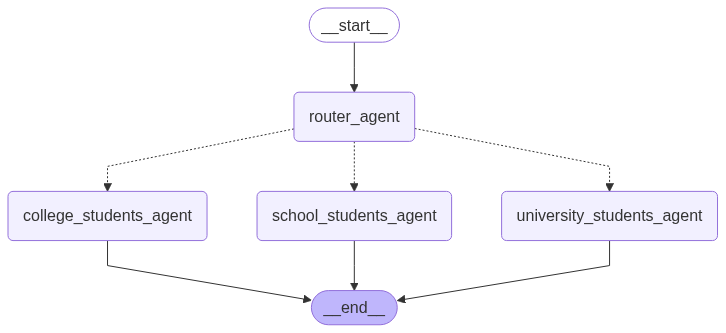

# 📚 Build a Multi-Agent System for Math Problem Solving

- 🏫 Level 1 Agent – School Students
- 🎓 Level 2 Agent – College Students
- 🎓👨‍🎓 Level 3 Agent – University Students

---

## 💡 Overview
This project demonstrates a **stateful multi-agent system** using LangGraph and LangChain.  
It integrates **Groq LLM**, prebuilt ReAct agents, and custom tools to handle queries for different user groups (school, college, university).  

---

## 🌐 Features
- 🧩 Modular agent design for school, college, and university students  
- 🔀 Dynamic routing logic to select the correct agent  
- 🤖 ReAct agents for reasoning + acting  
- 🌐 Integration with **ChatGroq LLM**  
- 📊 Visualizations and outputs supported via Python libraries  

## ✅ Outputs

### School Math Solver 

Multi-Agent Math Problem Solver (type 'exit' or 'quit' to stop): 5+6
--- Router Agent ---
Query: 5+6
LLM decision: school_students_agent
LLM decision: school_students_agent
--- School Students Agent ---

✅ Final Answer: The answer is 11.

Multi-Agent Math Problem Solver (type 'exit' or 'quit' to stop): 2x + 3y =10, if x=4 and what is the value of y?
--- Router Agent ---
Query: 2x + 3y =10, if x=4 and what is the value of y?
LLM decision: school_students_agent
LLM decision: school_students_agent
--- School Students Agent ---

✅ Final Answer: Let's try a different approach. 

Since we have a simple algebra problem, we can solve it directly.

Given the equation 2x + 3y = 10 and x = 4, we can substitute x with 4 to get:

2(4) + 3y = 10
8 + 3y = 10

Subtract 8 from both sides:

3y = 2

Divide both sides by 3:

y = 2/3

So, the value of y is 2/3.

Multi-Agent Math Problem Solver (type 'exit' or 'quit' to stop): Length = 6 and width = 4, what is the area of rectangle?
--- Router Agent ---
Query: Length = 6 and width = 4, what is the area of rectangle?
LLM decision: school_students_agent
LLM decision: school_students_agent
--- School Students Agent ---

✅ Final Answer: The area of the rectangle is 6 * 4 = 24.

Multi-Agent Math Problem Solver (type 'exit' or 'quit' to stop): What is the answer: (5*4) + (10-6) - (24/6) ?
--- Router Agent ---
Query: What is the answer: (5*4) + (10-6) - (24/6) ?
LLM decision: school_students_agent
LLM decision: school_students_agent
--- School Students Agent ---

✅ Final Answer: Let's try to solve it manually then.

To evaluate the expression `(5*4) + (10-6) - (24/6)`, we need to follow the order of operations (PEMDAS):

1. Multiply 5 and 4: `5*4 = 20`
2. Subtract 6 from 10: `10-6 = 4`
3. Divide 24 by 6: `24/6 = 4`
4. Add 20 and 4: `20 + 4 = 24`
5. Subtract 4 from 24: `24 - 4 = 20`

So, the final answer is 20.
### College Math Solver

--- Router Agent ---
Query: A box has 3 red balls and 2 blue balls. Two balls are drawn at random. Probability both are red?
LLM decision: college_students_agent
LLM decision: college_students_agent
--- College Students Agent ---

✅ Final Answer: The probability of drawing 2 red balls from a box with 3 red balls and 2 blue balls is 1/10.

Multi-Agent Math Problem Solver (type 'exit' or 'quit' to stop): Find the derivative of f(x)=4x^3 +5x^2 −7x+1
--- Router Agent ---
Query: Find the derivative of f(x)=4x^3 +5x^2 −7x+1
LLM decision: college_students_agent
LLM decision: college_students_agent
--- College Students Agent ---

✅ Final Answer: The derivative of f(x) = 4x^3 + 5x^2 - 7x + 1 is f'(x) = 12x^2 + 10x - 7.

Multi-Agent Math Problem Solver (type 'exit' or 'quit' to stop): Factoring:  𝑥^2 − 5 𝑥 + 6 ?
--- Router Agent ---
Query: Factoring:  𝑥^2 − 5 𝑥 + 6 ?
LLM decision: college_students_agent
LLM decision: college_students_agent
--- College Students Agent ---

✅ Final Answer: The factored form of x^2 - 5x + 6 is (x - 2)(x - 3).

### University Math Solver
--- Router Agent ---
Query: Compute the partial derivatives of f(x,y)=x^2+y+3xy^2
LLM decision: university_students_agent
LLM decision: university_students_agent
--- University Students Agent ---

✅ Final Answer: To find the partial derivatives of f(x,y) = x^2 + y + 3xy^2, we can use the following formulas:

∂f/∂x = ∂(x^2 + y + 3xy^2)/∂x = 2x + 3y^2
∂f/∂y = ∂(x^2 + y + 3xy^2)/∂y = 1 + 6xy

So, the partial derivatives are ∂f/∂x = 2x + 3y^2 and ∂f/∂y = 1 + 6xy.

Multi-Agent Math Problem Solver (type 'exit' or 'quit' to stop): Solve the ODE : (dx/dy)−2y=e^3x
--- Router Agent ---
Query: Solve the ODE : (dx/dy)−2y=e^3x
LLM decision: university_students_agent
LLM decision: university_students_agent
--- University Students Agent ---

✅ Final Answer: I apologize for the inconvenience. It seems that the tool is not working correctly. In this case, I'll try to solve the ODE manually.

The given ODE is (dx/dy) - 2y = e^(3x). This is a first-order linear ODE. We can solve it by using an integrating factor.

First, we can rewrite the ODE as dx/dy + (-2y) = e^(3x).

The integrating factor is μ(y) = e^(∫(-2)dy) = e^(-2y).

Multiplying both sides of the ODE by the integrating factor, we get:

e^(-2y) dx/dy + (-2y)e^(-2y) = e^(3x - 2y)

This can be written as d(e^(-2y)x)/dy = e^(3x - 2y).

Now, we can integrate both sides with respect to y:

∫d(e^(-2y)x) = ∫e^(3x - 2y) dy

e^(-2y)x = (1/3)e^(3x - 2y) + C, where C is the constant of integration.

Simplifying the equation, we get:

x = (1/3)e^(3x) + Ce^(2y)

This is the general solution to the given ODE.

Multi-Agent Math Problem Solver (type 'exit' or 'quit' to stop): Find the eigenvalues of the matrix  A=[2 1    1 2]
--- Router Agent ---
Query: Find the eigenvalues of the matrix  A=[2 1    1 2]
LLM decision: university_students_agent
LLM decision: university_students_agent
--- University Students Agent ---

✅ Final Answer: The eigenvalues of the matrix A = [[2, 1], [1, 2]] are 1 and 3.

